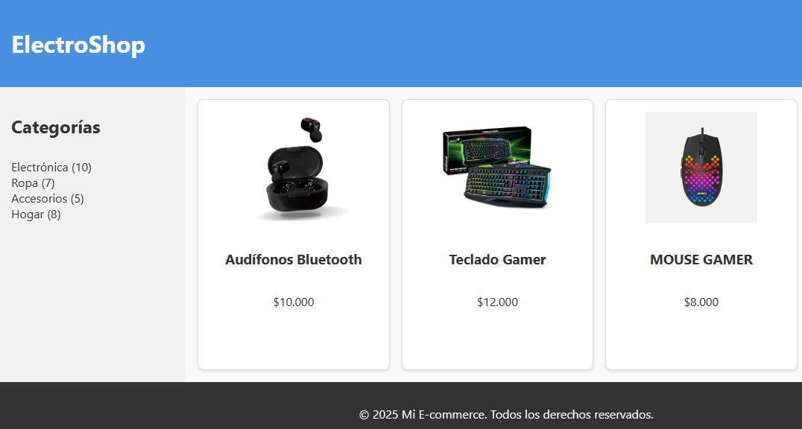

# 🛍️ Mi E-commerce - Layout con CSS Grid

Este proyecto consiste en la maquetación de una tienda online básica utilizando **HTML5**, **CSS Grid** y **Flexbox**, como parte de un desafío formativo para practicar layouts responsivos modernos.

## 📦 Estructura del proyecto

```
mi-ecommerce/
├── index.html
├── assets/
│   ├── css/
│   │   └── style.css
│   └── img/
│       ├── audifono.jpg
│       ├── teclado.jpg
│       └── mouse.jpg
```

## 🎯 Objetivo

- Crear un layout web utilizando `grid-template-areas` para estructurar la página principal.
- Implementar una barra lateral y tarjetas de producto con Flexbox.
- Desarrollar una grilla de productos responsiva usando CSS Grid.
- Aplicar un diseño atractivo, moderno y adaptable a distintos tamaños de pantalla.

## 💡 Tecnologías utilizadas

- HTML5
- CSS3
  - Grid Layout
  - Flexbox

## 📱 Diseño responsivo

La grilla de productos se adapta automáticamente según el ancho de la pantalla usando:

```css
grid-template-columns: repeat(auto-fit, minmax(200px, 1fr));
```
## 📸 Vista previa


## 🚀 Cómo usar

1. Clona el repositorio:
   ```bash
   git clone https://github.com/patriciovergara/e-commerce.git
   ```
2. Abre el archivo `index.html` en tu navegador.

## 📄 Licencia

Este proyecto tiene fines educativos. Puedes usarlo, modificarlo o adaptarlo libremente.
